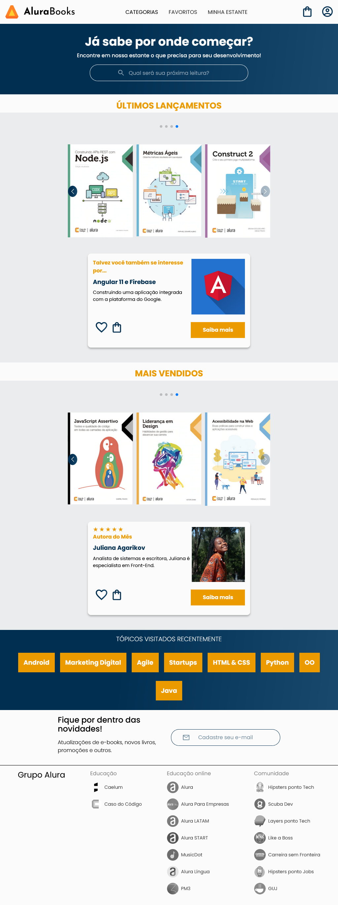
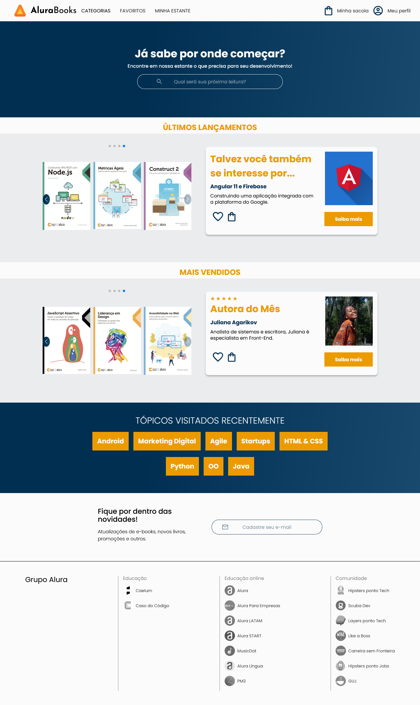

# AluraBooks

Projeto desenvolvido durante o curso de responsividade com mobile-first no progorama Desenvolve, projeto promovido pelo Grupo Boticário e a escola Alura. O objetivo foi a criação de um design responsivo a partir de 3 layouts (celular, tablet e desktop), começando com o menor layout e usando media queries para fazer as mudanças necessárias nos layouts maiores.

As tecnologias usadas foram HTML5 e CSS3, com um pouco de JavaScript usando o Swiper.js para a criação dos slides dos livros.

## Vercel

#### Celular ↓

#### Tablet e Telas Desktop Menores ↓

#### Desktop ↓

