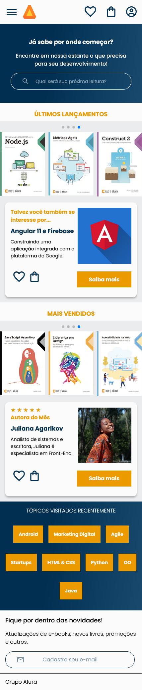

# AluraBooks

Projeto desenvolvido durante o curso de responsividade com mobile first no progorama Desenvolve, projeto promovido pelo Grupo Boticário e a escola Alura.

## Vercel

#### Celular ↓

#### Tablet e Telas Desktop Menores ↓

#### Desktop ↓

